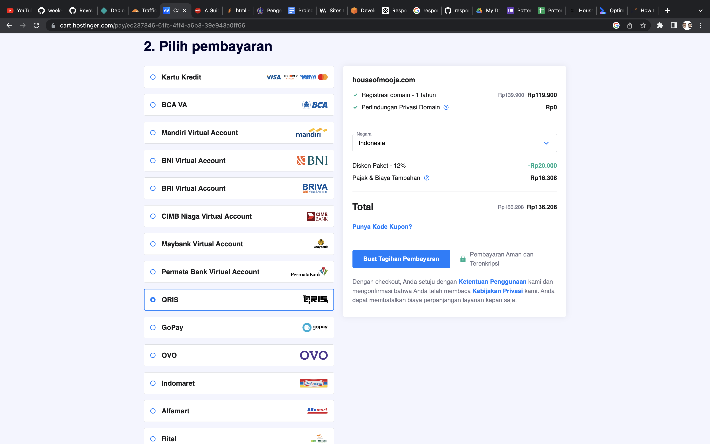
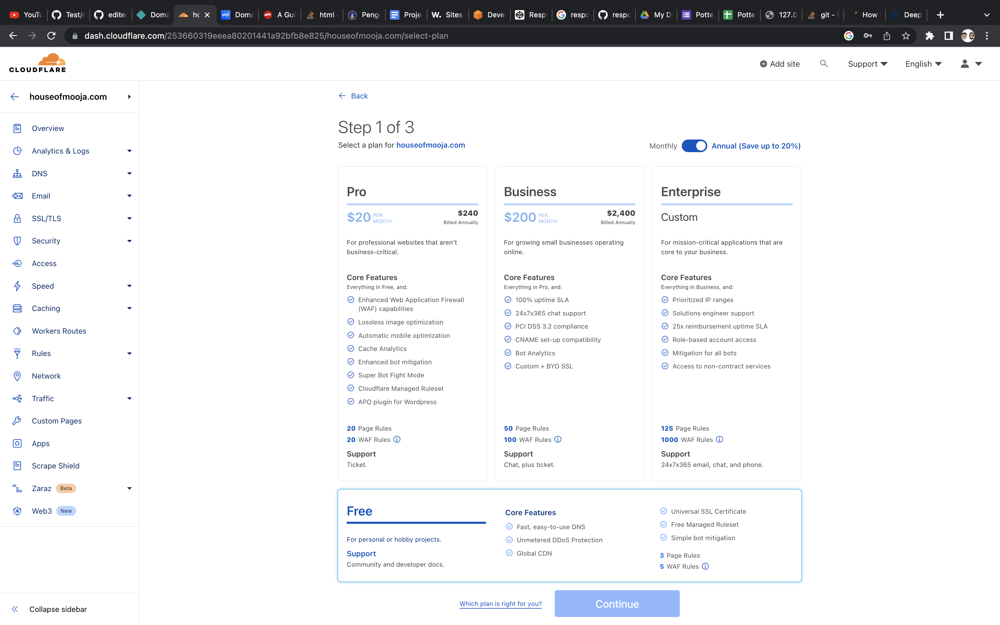

# Welcome to House of Mooja 

A website dedicated to my Business based in bandung, you will find our best seller products, and you can find our event and activities and the last sessions you can find our media social. 

[houseofmooja.com](www.houseofmooja.com) 

# Development Process

The section for the whole process of deployment: how to buy a custom domain at Niagahoster and how to connect netlify with cloudflare and the custom domain.

# Custom Domain 

1. Go to [NIagahoster](www.niagahoster.com) to buy your cusmtom domain
2. If you have account go to login page, if not you can sign up first 
3. In the search box, enter the domain you want.

4. If your domain available, proceed to "pilih" button.

5. After that you can choose the duration for your custom domain.
6. After you decide the duration, you can continue to "lanjutkan" button.
7. And choose for the payment methode (bank transfer,QR, or OVO DANA).

8. After complete the paymentt you can check in the section "Layanan Saya" your custome domain will appear here.

 # Add Custom Domain to Netlify 

1. Open [Cloudflare](www.cloudflare.com) on your web browser.
2. Sign in or sign up if you don't have an account.
3. Click button "Add a website or an application".
4. Enter your custom domain in the search box. Click "add site".

5. Choose your preffered package (Free, Pro, Business, Enterprise) according to your needs.

6. Review your DNS records and then "Continue", and "Confirm" to set up your DNS.
7. Cloudfare will ask you to change your nameservers on the registar's service page.

8. Copy the two nameservers given by Cloudfare to your Niagahoster account.

9.  After that, copy your Netlify's original domain, and go back to Cloudfare.
10. In an section "DNS" go to the "records".
11. Go to "Add record" and select the "type" with Cname.
12. And the "Name" fill witth youre custom domain.
13. And the "Content" with original Netlify domain.
14. Also in the DNS record section you can add the "Name" with WWW.
15. proceed to "Save".
16. Go back to Netlify - Domain section and click "Add a domain".

